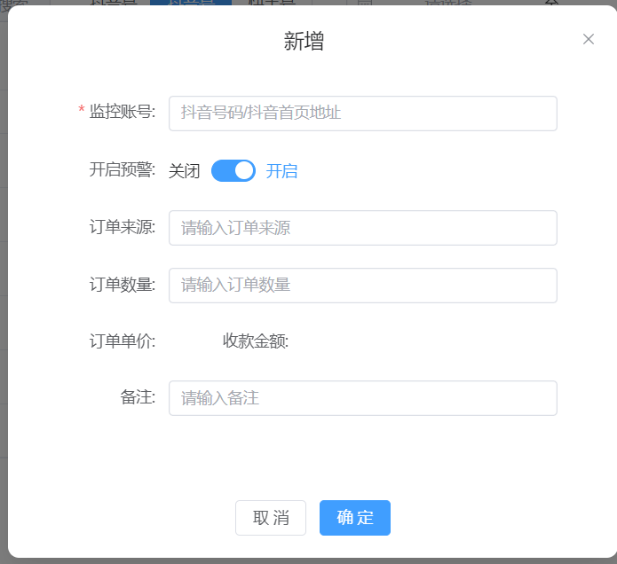

# vue3 版本的后台模板 使用 vite 构建

[简体中文](./README.md) | [English Doc](./README.en.md)

> 项目地址：https://github.com/didnhdj2/my-v3-admin

## 项目介绍

一个基于 Vue 技术栈的后台管理系统项目前端模板，使用了 vite、element-plus、axios、vue-router 和 pinia 等库进行开发。其中封装了基础组件 baseForm、baseModal、baseTable 等组件，只需要编写对应的配置文件，即可快速生成包含增删改查完整功能的页面，大大提高开发速度。

## 项目特点

- 使用配置式页面，仅需要编写配置文件，代码量大大减少
- 组件拆分，功能拆分，代码复用性高
- 使用灵活，可以随心所欲的配置页面，增加功能

## 封装的组件

### 1. baseForm

> 提供了表单的配置式编写方式，只需要编写配置文件，即可生成对应的表单，包含了表单验证，表单格式化，表单反格式化，表单事件等功能

- **灵活的插槽** 包含表单内插槽和表单外插槽，样式布局都具有极大的灵活性
- **内置多种组件**，包含大部分**element-plus**表单组件，并统一子组件事件回调出口，方便时间分发和处理
- **表单验证** 可配置自定义表单验证规则，支持自定义验证函数
- **格式化** 支持自定义提交时格式化函数和回显时反格式化函数，轻松处理数据转换

> 最常用的表格筛选，筛选操作逻辑已封装 hooks，方便使用

更多内容见[详细配置](./src/components/baseForm/readme.md)

### 2. baseModal

> 基于 baseForm 组件封装，配置文件基本相同

更多内容见[详细配置](./src/components/baseModal/readme.md)

### 3. baseTable

> 基于 element-plus 的 table 组件封装，可配置编辑单个单元格，编辑整行，并支持全部 table 事件

- **可编辑** 单列或者整行编辑，可编辑表格内置支持多种组件如 el-input、el-select 等，并支持编辑表格的格式化和反格式化回显
- **可配置** 可配置表格事件，如：排序，筛选，分页，导出等 el-table 全部事件，表格自定义 formatter 支持传入 h 函数，可自定义渲染
- **灵活插槽** 支持定义表格单列插槽
  

更多内容见[详细配置](./src/components/baseTable/readme.md)

## 开发计划

- [ ] baseEchart 组件
- [x] 完善配置文件的配置项，写入 sinppet
- [ ] 完善 hooks 抽取
- [ ] 完善公共样式
